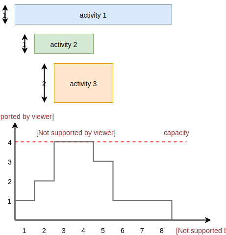
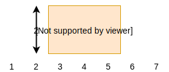
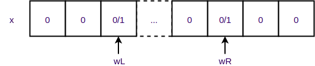

.. _minicp:

**********************
Unclassified Exercises
**********************

These exercises are from the course given in 2017-2018 @UCLouvain.
They are currently being refreshed, and separated into the various "parts" of the course.

..  Learning Outcomes
    =======================================
    Be able to
    * Understand reversible data structures
    * Understand a domain
    * Implement global constraints
    * Implement custom search
    * Model CP easy problems
    * Use LNS
    * Write unit-tests for constraints and models
    * Debug constraints, models, etc

Cumulative Constraint: Decomposition
====================================

The `Cumulative` constraint models a scheduling resource with fixed capacity.
It has the following signature:

.. code-block:: java

    public Cumulative(IntVar[] start, int[] duration, int[] demand, int capa)

where `capa` is the capacity of the resource and `start`, `duration`, and `demand` are arrays of the same size and represents
properties of activities:

* `start[i]` is the variable specifying the start time of activity `i`
* `duration[i]` is the duration of activity `i`
* `demand[i]` is the resource consumption or demand of activity `i`

The constraint ensures that the cumulative consumption of activities (also called consumption profile)
at any time is below a given capacity:

.. math:: \forall t: \sum_{i \mid t \in \left [start[i]..start[i]+duration[i]-1 \right ]} demand[i] \le capa

The next visual example depicts three activities and their corresponding
consumption profile. As it can be observed, the profile never exceeds
the capacity 4.

It corresponds to the instantiation of the Cumulative constraint:

.. code-block:: java

    Cumulative(start = [ 1, 2, 3], duration = [8, 3, 3], demand = [1, 2, 2], capa = 4)

Implement `CumulativeDecomp.java <https://bitbucket.org/minicp/minicp/src/HEAD/src/main/java/minicp/engine/constraints/CumulativeDecomp.java?at=master>`_.
This is a decomposition or reformulation of the cumulative constraint
in terms of simple arithmetic and logical constraints as
used in the above equation to describe its semantic.

At any time `t` of the horizon a `BoolVar overlaps[i]`
tells whether activity `i` overlaps time `t` or not.
Then the overall consumption in `t` is obtained by:

.. math:: \sum_{i} overlaps[i]*demand[i] \le capa

First make sure you understand the following code, then
add the few lines in the `TODO` to make
sure `overlaps` has the intended meaning.

.. code-block:: java

    public void post() throws InconsistencyException {

        int min = Arrays.stream(start).map(s -> s.getMin()).min(Integer::compare).get();
        int max = Arrays.stream(end).map(e -> e.getMax()).max(Integer::compare).get();

        for (int t = min; t < max; t++) {

            BoolVar[] overlaps = new BoolVar[start.length];
            for (int i = 0; i < start.length; i++) {
                overlaps[i] = makeBoolVar(cp);

                // TODO
                // post the constraints to enforce
                // that overlaps[i] is true iff start[i] <= t && t < start[i] + duration[i]
                // hint: use IsLessOrEqual, introduce BoolVar, use views minus, plus, etc.
                //       logical constraints (such as logical and can be modeled with sum)

            }

            IntVar[] overlapHeights = makeIntVarArray(cp, start.length, i -> mul(overlaps[i], demand[i]));
            IntVar cumHeight = sum(overlapHeights);
            cumHeight.removeAbove(capa);

        }

Check that your implementation passes the tests `CumulativeDecompTest.java <https://bitbucket.org/minicp/minicp/src/HEAD/src/test/java/minicp/engine/constraints/CumulativeDecompTest.java?at=master>`_.

Cumulative Constraint: Time-Table filtering
==============================================

The Cumulative and Time-Table Filtering introduced in  [TT2015]_
is an efficient yet simple filtering for Cumulative.

It is a two stage algorithm:

1. Build an optimistic profile of the resource consumption and check it does not exceed the capacity.
2. Filter the earliest start of the activities such that they are not in conflict with the profile.

Consider on the next example the depicted activity that can be executed anywhere between
the two brackets.
It can not execute at its earliest start since this would
violate the capacity of the resource.
We thus need to push the activity up until we find a time
where it can execute over its entire duration
without being in conflict with the profile and the capacity.
The earliest time  is 7.

.. image:: ../_static/timetable2.svg
    :scale: 50
    :width: 600
    :alt: scheduling timetable1

**Profiles**

We provide a class `Profile.java <https://bitbucket.org/minicp/minicp/src/HEAD/src/main/java/minicp/engine/constraints/Profile.java?at=master>`_
that is able to build efficiently a resource profile given an array of rectangles in input.
A rectangle has three attributes: `start`, `end`, `height` as shown next:

A profile is nothing else than a sequence of rectangles.
An example of profile is given next. It is built from three input rectangles provided to the constructor
of `Profile.java <https://bitbucket.org/minicp/minicp/src/HEAD/src/main/java/minicp/engine/constraints/Profile.java?at=master>`_.
The profile consists in 7 contiguous rectangles.
The first rectangle `R0` starts at `Integer.MIN_VALUE` with a height of zero
and the last rectangle `R6` ends in `Integer.MAX_VALUE` also with a height of zero.
These two `dummy` rectangles are convenient because they guarantee
the property that any time point falls on one rectangle of the profile.

.. image:: ../_static/profile.svg
    :scale: 50
    :width: 650
    :alt: profile

Make sure you understand how to build and manipulate
`Profile.java <https://bitbucket.org/minicp/minicp/src/HEAD/src/main/java/minicp/engine/constraints/Profile.java?at=master>`_.

Have a quick look at `ProfileTest.java <https://bitbucket.org/minicp/minicp/src/HEAD/src/test/java/minicp/engine/constraints/ProfileTest.java?at=master>`_
for some examples of profile construction.

**Filtering**

Implement `Cumulative.java <https://bitbucket.org/minicp/minicp/src/HEAD/src/main/java/minicp/engine/constraints/Cumulative.java?at=master>`_.
You have three TODO tasks:

1. Build the optimistic profile from the mandatory parts.
2. Check that the profile is not exceeding the capacity.
3. Filter the earliest start of activities.

*TODO 1* is to build the optimistic profile
from the mandatory parts of the activities.
As can be seen on the next visual example, a mandatory part of an activity
is a part that is always executed whatever will be the start time of the activity
on its current domain.
It is the rectangle starting at `start[i].getMax()` that ends in `start[i].getMin()+duration()`
with a height equal to the demand of the activity.
Be careful because not every activity has a mandatory part.

.. image:: ../_static/timetable1.svg
    :scale: 50
    :width: 600
    :alt: scheduling timetable1

*TODO 2* is to check that the profile is not exceeding the capacity.
You can check that each rectangle of the profile is not exceeding the capacity
otherwise you throw an `InconsitencyException`.

*TODO 3* is to filter the earliest start of unbound activities by pushing each
activity (if needed) to the earliest slot when it can be executed without violating the capacity threshold.

.. code-block:: java

    for (int i = 0; i < start.length; i++) {
            if (!start[i].isBound()) {
                // j is the index of the profile rectangle overlapping t
                int j = profile.rectangleIndex(start[i].getMin());
                // TODO 3: push i to the right
                // hint:
                // You need to check that at every-point on the interval
                // [start[i].getMin() ... start[i].getMin()+duration[i]-1] there is enough space.
                // You may have to look-ahead on the next profile rectangle(s)
                // Be careful that the activity you are currently pushing may have contributed to the profile.

            }
        }

Check that your implementation passes the tests `CumulativeTest.java <https://bitbucket.org/minicp/minicp/src/HEAD/src/test/java/minicp/engine/constraints/CumulativeTest.java?at=master>`_.

.. [TT2015] Gay, S., Hartert, R., & Schaus, P. (2015, August). Simple and scalable time-table filtering for the cumulative constraint. In International Conference on Principles and Practice of Constraint Programming (pp. 149-157). Springer.

The Resource-Constrained Project Scheduling Problem (RCPSP)
================================================================

A set of activities must be executed on a set of resources.

Fill in all the gaps in order to solve the RCPSP problem.

Your task is to terminate the implementation in
`RCPSP.java <https://bitbucket.org/minicp/minicp/src/HEAD/src/main/java/minicp/examples/RCPSP.java?at=master>`_.

* Create the cumulative constraint
* Post the precedence constraint
* Add instructions to minimize the makespan
* Minimize the makespan

Several instance of increasing sizes are available with 30,60,90 and 120 activities.
In order to test your model, the instance ``j30_1_1.rcp`` should have a minimum makespan of 43.
Don't expect to prove optimality for large size instances but you should reach it easily for 30 activities.

The JobShop Problem and disjunctive resource
=======================================================

Your task is to make the disjunctive constraint more efficient than using the cumulative constraint with unary capacity.

* Implement the constraint `IsLessOrEqualVar.java <https://bitbucket.org/minicp/minicp/src/HEAD/src/main/java/minicp/engine/constraints/IsLessOrEqualVar.java?at=master>`_
  for the reification `b iff x <= y`.
  This one will be useful implementing the decomposition for the disjunctive constraint..
* Test your implementation in `IsLessOrEqualVarTest.java. <https://bitbucket.org/minicp/minicp/src/HEAD/src/test/java/minicp/engine/constraints/IsLessOrEqualVarTest.java?at=master>`_
* Implement the decompostion with reified constraint for the `Disjunctive.java. <https://bitbucket.org/minicp/minicp/src/HEAD/src/main/java/minicp/engine/constraints/Disjunctive.java?at=master>`_ `
* Test if (as expected) this decomposition prunes more than the formulation with the TimeTable filtering for the cumulative constraint.
  Observe on the `JobShop.java <https://bitbucket.org/minicp/minicp/src/HEAD/src/main/java/minicp/examples/JobShop.java?at=master>`_ problem if the number of backtracks is reduced with the decomposition instead of the formulation with the cumulative.
  Test for instance on the small instance `data/jobshop/sascha/jobshop-4-4-2` with 4 jobs, 4 machines, 16 activities.
* Read and make sure you understand the implementation  `ThetaTree.java. <https://bitbucket.org/minicp/minicp/src/HEAD/src/main/java/minicp/engine/constraints/ThetaTree.java?at=master>`_
  Some unit-tests are implemented in `ThetaTreeTest.java. <https://bitbucket.org/minicp/minicp/src/HEAD/src/test/java/minicp/engine/constraints/ThetaTreeTest.java?at=master>`_
  To make sure you understand it, add a unit-test with 4 activities and compare the results with a manual computation.
* The overlad-checker, detectable precedences, not-first, edge-finding only filter one side of the activities.
  To get the symmetrical filtering implement the mirroring activities trick similarly to `Cumulative.java <https://bitbucket.org/minicp/minicp/src/HEAD/src/main/java/minicp/engine/constraints/Cumulative.java?at=master>`_.
* Implement the overload-checker in `Disjunctive.java <https://bitbucket.org/minicp/minicp/src/HEAD/src/main/java/minicp/engine/constraints/Disjunctive.java?at=master>`_
* The overload-checker should already make a big difference to prune the search tree. Make sure that larger-job-shop instances are now accessible for instance the `data/jobshop/sascha/jobshop-6-6-0` should now become easy to solve.
* Implement the detectable-precedence in `Disjunctive.java <https://bitbucket.org/minicp/minicp/src/HEAD/src/main/java/minicp/engine/constraints/Disjunctive.java?at=master>`_
* Implement the not-first-not last in `Disjunctive.java <https://bitbucket.org/minicp/minicp/src/HEAD/src/main/java/minicp/engine/constraints/Disjunctive.java?at=master>`_
* Make sure you pass the tests `DisjunctiveTest.java <https://bitbucket.org/minicp/minicp/src/HEAD/src/test/java/minicp/engine/constraints/DisjunctiveTest.java?at=master>`_
* (optional for a bonus) Implement the edge-finding in `Disjunctive.java <https://bitbucket.org/minicp/minicp/src/HEAD/src/main/java/minicp/engine/constraints/Disjunctive.java?at=master>`_ (you will also need to implement the ThetaLambdaTree data-structure).

The logical or constraint and watched literals
=======================================================

* Implement the constraint `Or.java <https://bitbucket.org/minicp/minicp/src/HEAD/src/main/java/minicp/engine/constraints/Or.java?at=master>`_
  for modeling the logical clause constraint: `(x[0] or x[1] or x[2] ... x[n-1])`.
* Test your implementation in `OrTest.java. <https://bitbucket.org/minicp/minicp/src/HEAD/src/test/java/minicp/engine/constraints/OrTest.java?at=master>`_
* The implementation should use the watched literals technique.

A reminder about the watched literals technique:

*  The constraint should only listen to the changes of two unbound variables with `propagateOnBind(this)`
  and dynamically listen to other ones whenever of these two become bound. Keep in mind that
  any call to `x[i].propagateOnBind(this)` has a reversible effect on backtrack.
* Why two ? Because as long as there is one unbound one, the constraint is still satisfiable and nothing need to be propagated
  and whenever it is detected that only one is unbound and all the other ones are set to false,
  the last one must be set to true (this is called unit propagation in sat-solvers).
* The two unbound variables
  should be at indexes `wL` (watched left) and `wR` (watched right).
  As depicted below `wL` (`wR`) is the left (right) most unbound variable.
* Those indices are store in `ReversibleInt` such that they can only increase during search (incrementality).
* When `propagate` is called, it means that one of the two watched variable is bound (`x[wL] or x[wR]`) and
  consequently the two pointers must be updated.
* If during the update a variable bound to `true` is detected, the constraint can be deactivated since it will always be satisfied.

The logical reified or constraint
=======================================================

* Implement the constraint `IsOr.java <https://bitbucket.org/minicp/minicp/src/HEAD/src/main/java/minicp/engine/constraints/IsOr.java?at=master>`_
  for modeling the logical clause constraint: `b iff (x[0] or x[1] or x[2] ... x[n-1])`.
* Test your implementation in `IsOrTest.java. <https://bitbucket.org/minicp/minicp/src/HEAD/src/test/java/minicp/engine/constraints/IsOrTest.java?at=master>`_
* In case `b` is true, you can post your previous `Or` constraint
(create it once and forall and post it when needed to avoid creating objects during search that would trigger Garbage Collection).

Steel Mill Slab Problem: Modeling, redundant constraints and symmetry breaking
======================================================================================

A number of TODO must be completed in `Steel.java <https://bitbucket.org/minicp/minicp/src/HEAD/src/main/java/minicp/examples/Steel.java?at=master>`_
that will gradually improve the performance for solving this problem optimally.

1. Model the objective function computing the total loss to be minimized. You should use element constraints to compute the loss
   in each slab. The precomputed array `loss` gives for each load (index) the loss
   that would be induced. It is precomputed as the difference between the smallest capacity that can accommodate
   the load and the load value. A sum constraint constraint can then be used to compute the total loss.

2. Model a boolean variable reflecting the presence or not of each color in each slab.
   The color is present if at least one order with such color is present.
   The `IsOr` constraint previously implemented can be used for that.
3. Restrict the number of colors present in slab j to be <= 2.
   Your model can now be run, although it will not be able to solve optimally yet the easiest instance `data/steel/bench_20_0`.
4. Add a redundant constraint for the bin-packing stating that sum of the loads is equal to the sum of elements.
   Do you observe an improvement in the solving complexity ?
5. Add static symmetry breaking constraint. Two possibilities: the load of slabs must be decreasing or the losses must be decreasing.
   Do you observe an improvement in the solving complexity ?
6. Implement a dynamic symmetry breaking during search. Select an order `x` representing the slab where this order is placed.
   Assume that the maximum index of a slab containing an order is m.
   Then create m+1 branches with x=0,x=1,...,x=m,x=m+1 since all the decisions x=m+2,x=m+3 ... would subproblems symmetrical with x=m+1.
   You should now be able to solve optimally the instance 'data/steel/bench_20_0' reaching a zero loss solution.

Discrepancy Limited Search (optional)
=================================================================

Implement ``LimitedDiscrepancyBranching``, a branching that can wrap any branching
to limit the discrepancy of the branching.

Test your implementation in `LimitedDiscrepancyBranchingTest.java. <https://bitbucket.org/minicp/minicp/src/HEAD/src/test/java/minicp/search/LimitedDiscrepancyBranchingTest.java?at=master>`_

Conflict based search strategy
=================================================================

Last Conflict [LC2009]_
Conflict Ordering Search [COS2015]_

.. [LC2009] Lecoutre, C., Saïs, L., Tabary, S., & Vidal, V. (2009). Reasoning from last conflict (s) in constraint programming. Artificial Intelligence, 173(18), 1592-1614.

.. [COS2015] Gay, S., Hartert, R., Lecoutre, C., & Schaus, P. (2015). Conflict ordering search for scheduling problems. In International conference on principles and practice of constraint programming (pp. 140-148). Springer.

Restarts (optional)
========================

TODO

  
     

