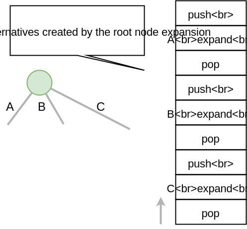

*****************************************************************
Part 3: Memory Management (Trail + Copy) and Search
*****************************************************************

*We ask you not to publish your solutions on a public repository.
The instructors interested to get the source-code of
the solutions can contact us.*

Slides
======

`Memory Management: Copy and Trail, Search <https://www.icloud.com/keynote/0wmHrabdvZYKaDOBYv-wK09Wg#03-state-management-search>`_

Theoretical questions
=====================

* `TODO <https://inginious.org/course/minicp/domains>`_

DFS Explicit Stack
===================

The search algorithm of Mini-CP is *depth-first-search*.
It is implemented using a recursive method in the class
`DFSSearch.java <https://bitbucket.org/minicp/minicp/src/HEAD/src/main/java/minicp/search/DFSearch.java?at=master>`_.
To avoid any `stack-overflow` exception due to too a deep recursion in Java
we ask you to reimplement the depth-first-search with an explicit stack
of instead of relying on the recursion call stack.

Consider the following search tree where alternatives to execute are represented as letters.

.. image:: ../_static/dfs.svg
    :scale: 50
    :width: 250
    :alt: DFS

A DFS exploration should executes the alternative in the following order `A->D->E->B->C->F->G`.
On backtrack, the state should be restored and therefore these successive executions of the alternatives
should be interleaved with 'push' and 'pop' operations on the trail.
For instance a valid sequence for restoring the states on backtrack is the following:
`push->A->push->D->pop->push->E->pop->pop->push->B->pop->push->C->push->F->pop->push->G->pop->pop`.
The `push` operations are executed in pre-order fashion while the `pop` operations are executed in a post-order fashion.
This is highlighted in the recursive dfs code given next.

.. code-block:: java
   :emphasize-lines: 10, 13, 19

        private void dfs(SearchStatistics statistics, SearchLimit limit) {
            if (limit.stopSearch(statistics)) throw new StopSearchException();
            Alternative [] alternatives = choice.call(); // generate the alternatives
            if (alternatives.length == 0) {
                statistics.nSolutions++;
                notifySolutionFound();
            }
            else {
                for (Alternative alt : alternatives) {
                    state.push(); // pre-order
                    try {
                        statistics.nNodes++;
                        alt.call(); // call the alternative
                        dfs(statistics,limit);
                    } catch (InconsistencyException e) {
                        notifyFailure();
                        statistics.nFailures++;
                    }
                    state.pop(); // post-order
                }
            }
        }

    A skeletton of solution is given next but you don't have to follow exactly this solution since there are many ways
    to implement it.

.. code-block:: java
   :emphasize-lines: 3

        private void dfs(SearchStatistics statistics, SearchLimit limit) {
            Stack<Alternative> alternatives = new Stack<Alternative>();
            expandNode(alternatives,statistics); // root expension
            while (!alternatives.isEmpty()) {
                if (limit.stopSearch(statistics)) throw new StopSearchException();
                try {
                    alternatives.pop().call();
                } catch (InconsistencyException e) {
                    notifyFailure();
                    statistics.nFailures++;
                }
            }
        }
        private void expandNode(Stack<Alternative> alternatives, SearchStatistics statistics) {
           // TODO
        }

    The idea of this solution is wrap the push/pop/alternative execution inside `Alternative` closure objects
as illustrated on the next figure showing the stack after the root node expansion at line 3.

Check that your implementation passes the tests `DFSearchTest.java <https://bitbucket.org/minicp/minicp/src/HEAD/src/test/java/minicp/search/DFSearchTest.java?at=master>`_

Remark (optional): It is actually possible to reduce the number of operations on the trail
by skipping the push on a last branch at a given node.
The sequence of operations becomes `push->push->A->push->D->pop->E->pop->push->B->pop->C->push->F->pop->G->pop`.

Implement a Custom Search
=================================

Modify the Quadratic Assignment Model `QAP.java <https://bitbucket.org/minicp/minicp/src/HEAD/src/main/java/minicp/examples/QAP.java?at=master>`_
to implement a custom search strategy. A skeleton for a custom search is the following one:

.. code-block:: java

        DFSearch dfs = makeDfs(cp,
                selectMin(x,
                        x -> x.getSize() > 1, // filter
                        x -> x.getSize(), // variable selector
                        xi -> {
                            int v = xi.getMin(); // value selector (TODO)
                            return branch(() -> equal(xi,v),
                                    () -> notEqual(xi,v));
                        }
                ));

* As a variable heuristic, select the unbound variable `x[i]` (a facility `i` not yet assigned to a location) that has a maximum weight `w[i][j]` with another facility `j` (`x[j]` may be bound or not).
* As a value heuristic, on the left branch, place this facility to on the location which is the closest possible to another location possible for facility `j`. On the right branch remove this value.
* Hint: `selectMin` is a generic method parameterized by 'T'. To implement this heuristic, adding pairs `(i,j)` as a type for `T` is probably the easiest way to go.

.. code-block:: java

    public static <T> Choice selectMin(T[] x, Filter<T> p, ValueFun<T> f, BranchOn<T> body)

